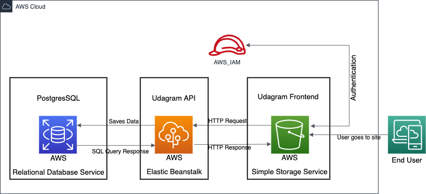
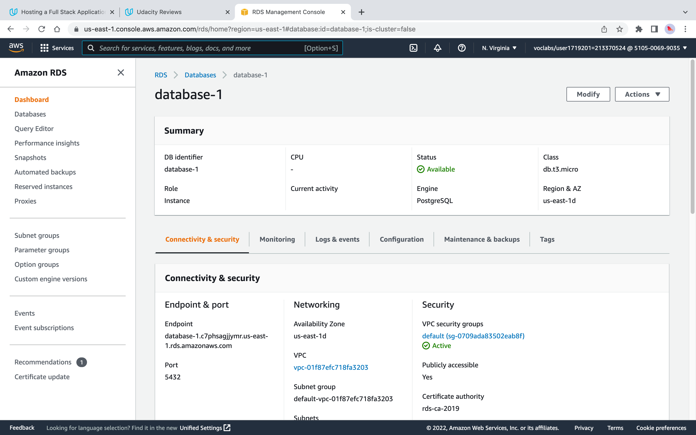
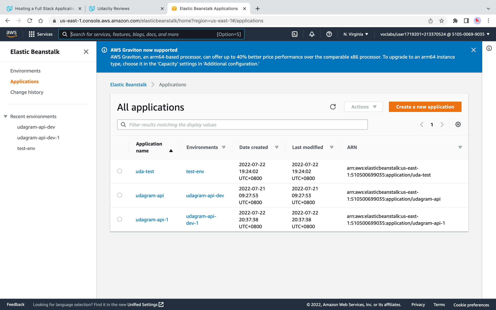
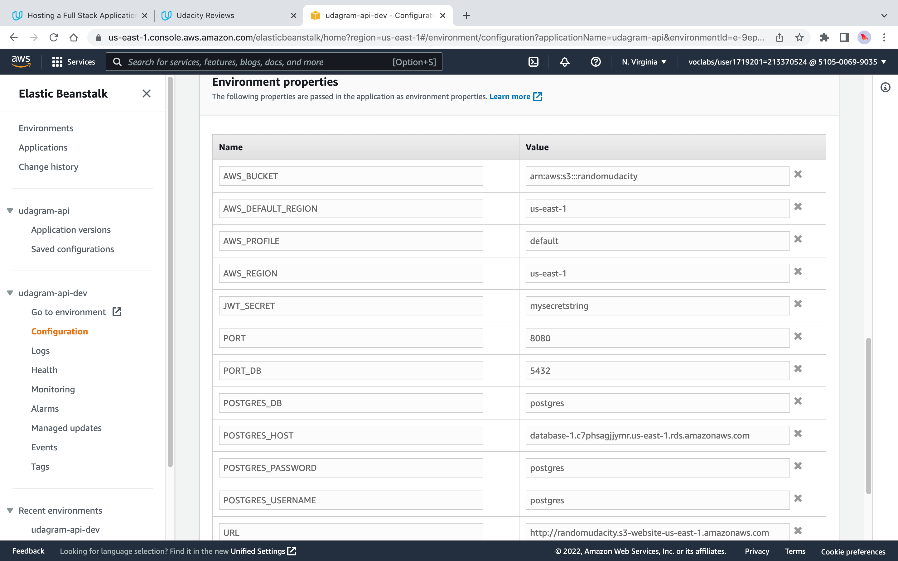
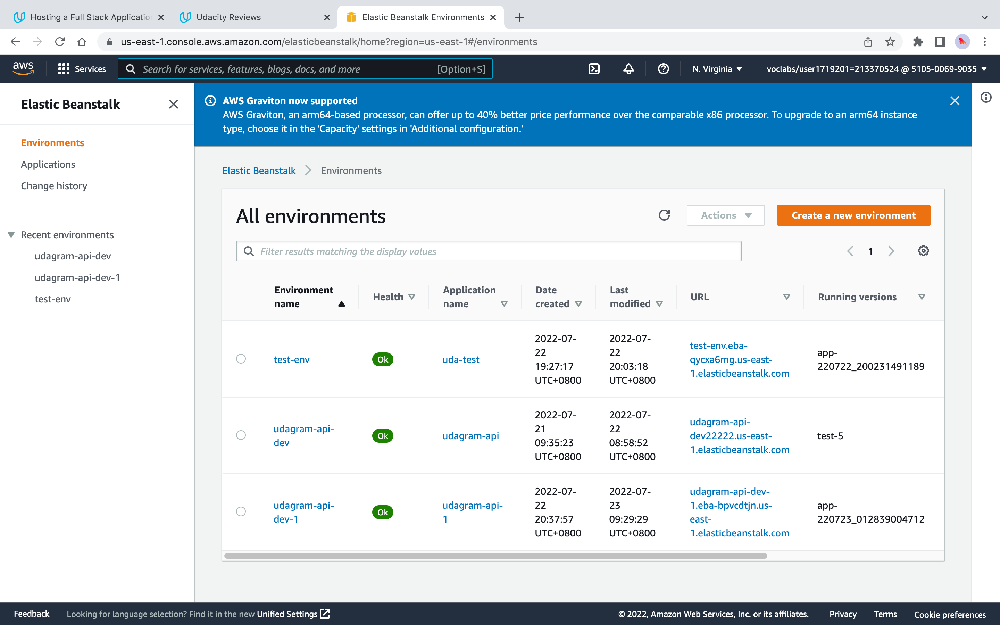
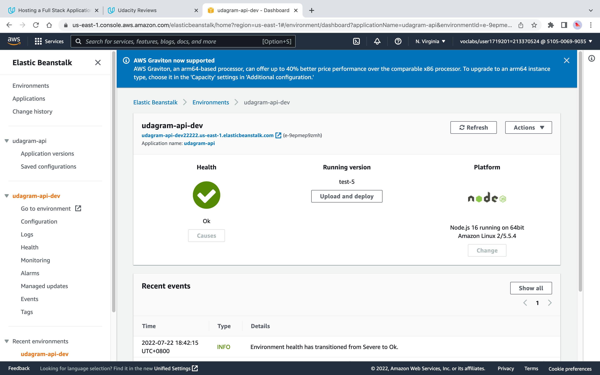
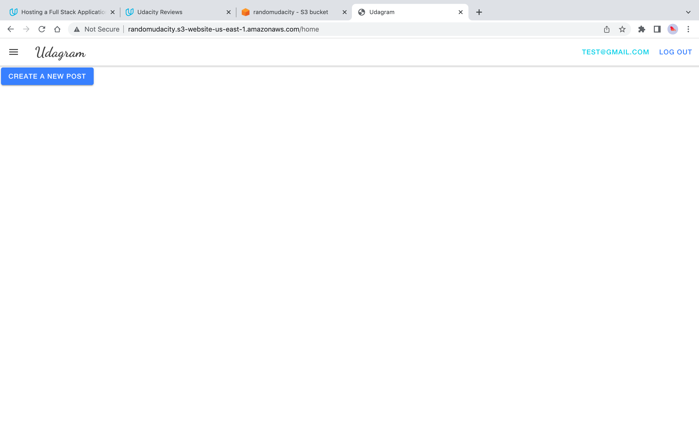

## Infrastructure Description

* Udagram Architecture

* AWS RDS PostgreSQL Database

* AWS Elastic Beanstalk Applications

* AWS Elastic Beanstalk Configurations

* AWS Elastic Beanstalk Environments

* AWS Elastic Beanstalk API Server Health

* Frontend Homepage

* Frontend User Logged In

