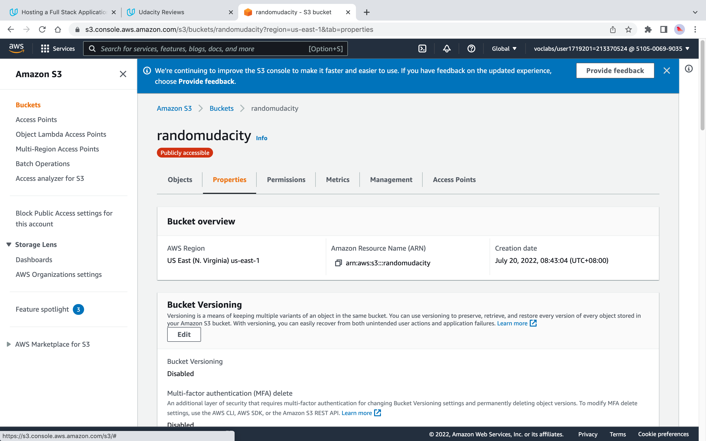
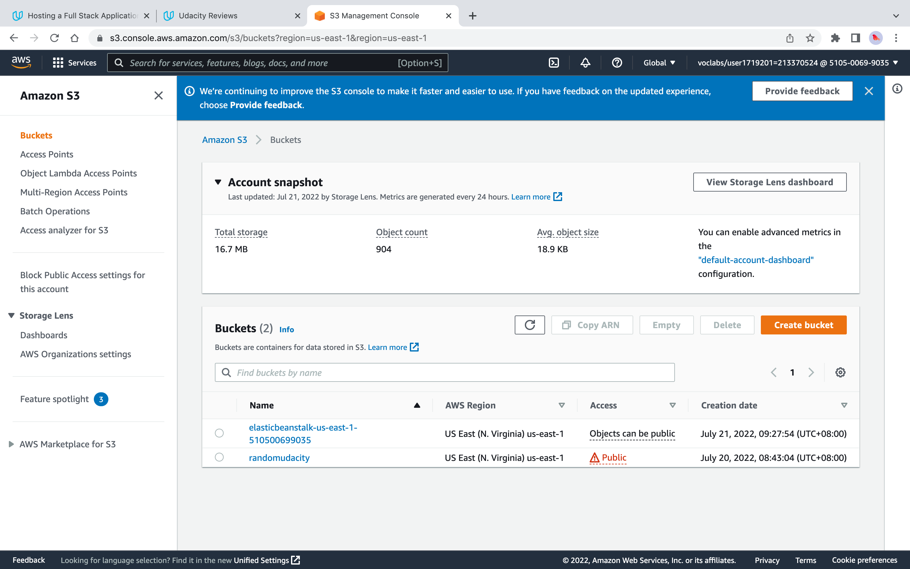
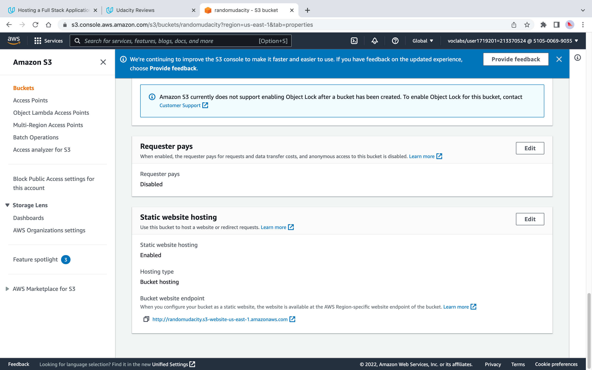
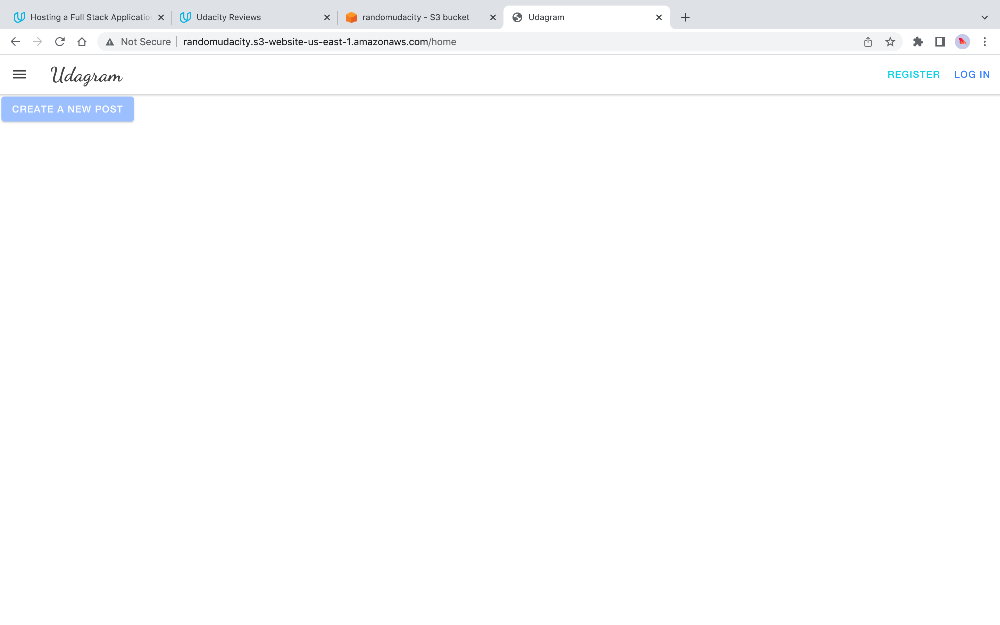

## Infrastructure Description

* Udagram Architecture

* AWS RDS PostgreSQL Database

* AWS S3 ARN

* AWS S3 Buckets

* AWS S3 Static Web Hosting Link

* AWS Elastic Beanstalk Applications

* AWS Elastic Beanstalk Configurations

* AWS Elastic Beanstalk Environments

* AWS Elastic Beanstalk API Server Health

* Frontend Homepage

* Frontend User Logged In

