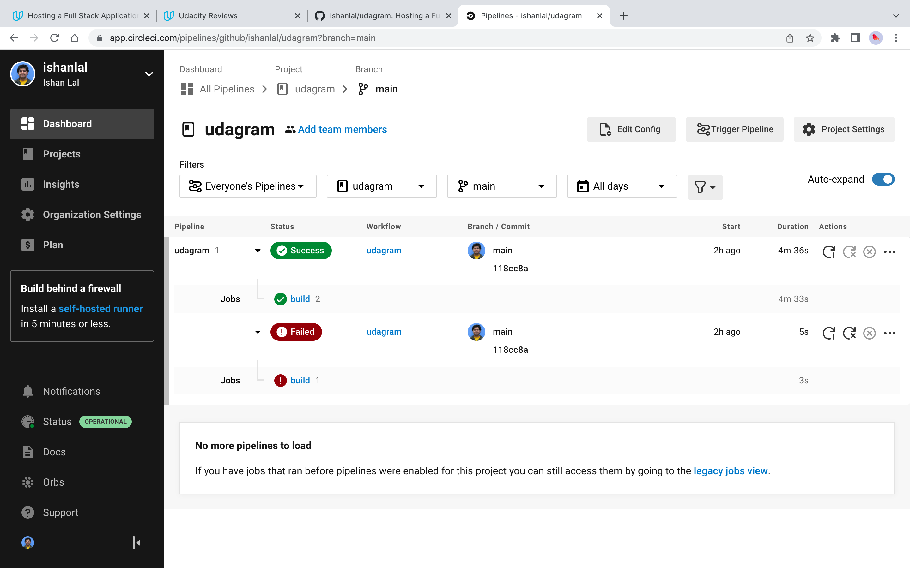
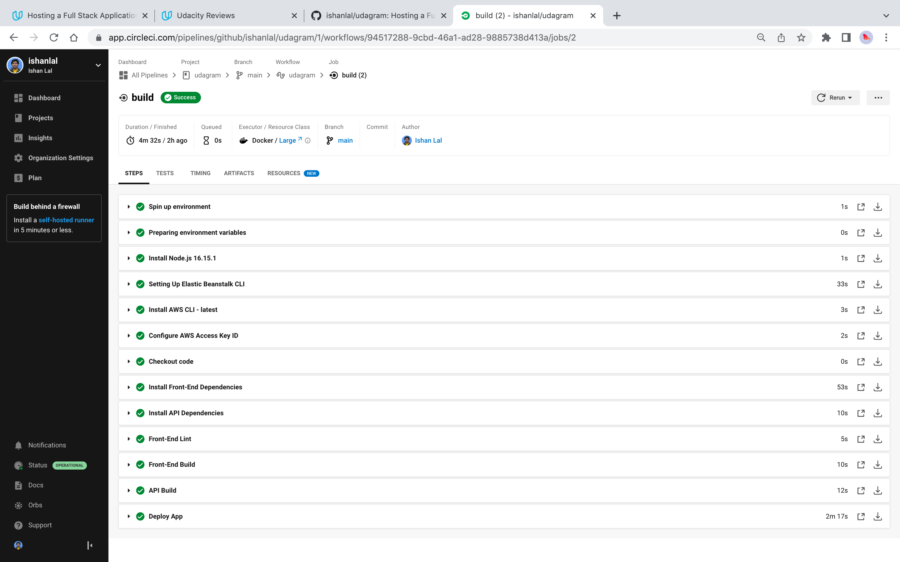
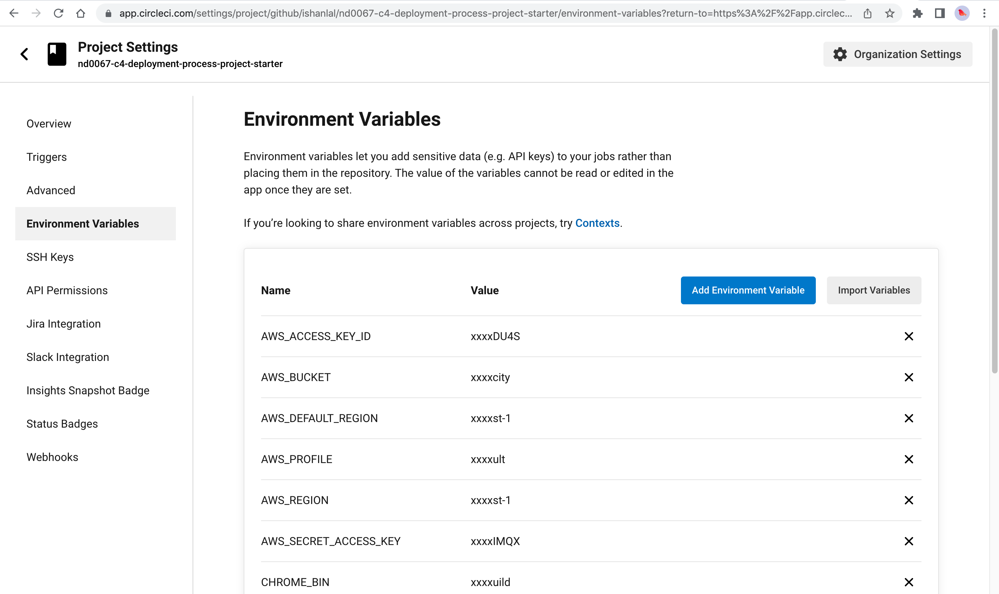
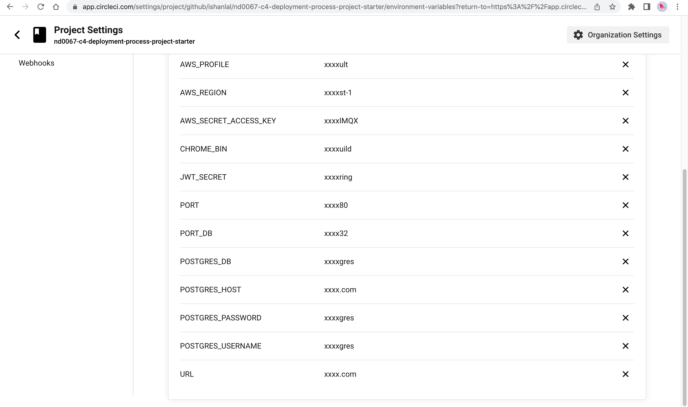

## CI/CD Pipeline:

* CircleCi account has been authorized to access the repo on Github.
* The pipeline triggers a successful build on each push to the main branch.
* The pipeline successfully automates the install, build and deploy processes for the app.

## Screenshots:

* CircleCI Pipeline Dashboard

* Successful Pipeline Build

* Environment Variables

